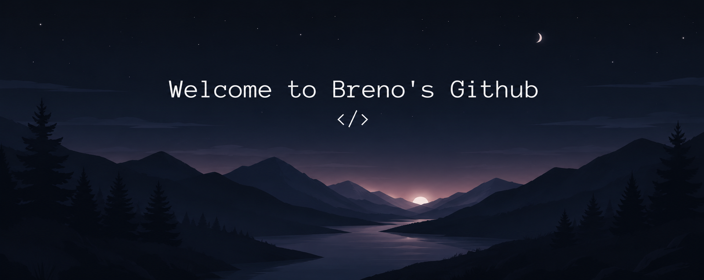

  
 

 

<h2 align="center">  <em>About  me </em></h2>

 

  Olá! <em><b> Eu sou Breno Kauê </b></em>, um estudante de tecnologia focado em desenvolvimento Back-end. Gosto de aprender novas tecnologias, resolver problemas de programação e criar projetos para evoluir minhas habilidades todos os dias. Atualmente estou estudando JavaScript, APIs, Banco de Dados, Node.js e Inteligência Artificial, enquanto desenvolvo pequenos projetos para colocar meu conhecimento em prática.

 

 
 
<h2 align="center">  <em> Technologies </em> </h2>

  
  
  
  
  <!---  -->
  
  
  
  

 

<h2 align="center"">  <em> Statistics </em> </h2>

  
  

